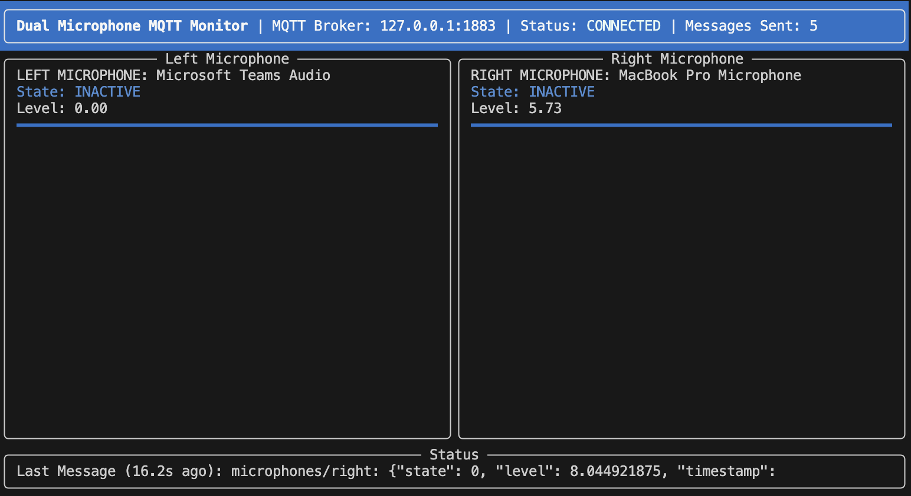

# Mic Level Monitor -> MQTTlevel state sender

A dual microphone MQTT monitor that detects audio activity and publishes events to MQTT topics, with a rich terminal user interface.



## Features

- Real-time monitoring of two separate microphones
- Audio level visualization with configurable thresholds
- MQTT integration for IoT connectivity
- Rich, interactive terminal user interface
- Persistent configuration management
- Resilient reconnection handling

## Requirements

- Python 3.12+
- macOS (optimized for Apple Silicon M1/M2/M3)
- MQTT broker (like Mosquitto)

## Installation

### 1. Clone the Repository

```bash
git clone https://github.com/yourusername/mic-level-monitor.git
cd mic-level-monitor
```

### 2. Install UV (if not already installed)

UV is a fast, reliable Python package installer and resolver.

```bash
# Install UV using pip
brew install uv

# Verify installation
uv --version
```

### 3. Create and Activate a Virtual Environment

```bash
# Create a virtual environment with UV
uv venv

# Activate the virtual environment
source .venv/bin/activate
```

### 4. Install the Package

```bash
# Install the package in development mode
uv pip install -e .
```

## Usage

### First time config

```bash
# Create default configuration file
mic-monitor --create-default-config
```

### Basic Usage

```bash
# Run using the installed script, specifying MQTT broker (adjust as per needed)
mic-monitor --broker 127.0.01 --port 1883

# or run directly as a module, specifying MQTT broker (adjust as per needed)
python -m mic_level_monitor --broker 127.0.01 --port 1883

# If same broker config will be used consistently, then you can run 
python -m mic_level_monitor
# or
mic-monitor
```

### Other cmdline affordances available

```bash
# List available audio devices
mic-monitor --list-devices

# Specify microphone indices
mic-monitor --left-mic 1 --right-mic 2

# Set custom audio threshold
mic-monitor --threshold 600
```

## Configuration

The app uses TOML configuration files

- `default_config.toml` - Default settings
- `config.toml` - User settings (overrides defaults)

Example configuration:

```toml
[mqtt]
broker = "localhost"
port = 1883
client_id = "mic_monitor"

[mqtt.topics]
left = "microphones/left"
right = "microphones/right"

[audio]
threshold = 500
check_interval = 0.2

[ui]
refresh_rate = 0.1
```

## Project Structure

```txt
├── README.md
├── config.toml         # default configuration
├── default_config.toml # user configuration
├── mic_level_monitor
│   ├── __init__.py     # Package initialization
│   ├── __main__.py     # Entry point
│   ├── audio           # Audio processing
│   │   ├── __init__.py
│   │   └── microphone.py
│   ├── config          # Configuration management
│   │   ├── __init__.py
│   │   └── config_manager.py
│   ├── monitoring      # Core monitoring business logic
│   │   ├── __init__.py
│   │   └── processor.py
│   ├── mqtt            # MQTT client management
│   │   ├── __init__.py
│   │   └── client.py
│   └── ui              # Terminal UI components (uses RICH)
│       ├── __init__.py
│       └── layout.py
├── mic_level_monitor.egg-info 
├── pyproject.toml      # Project settings and depency management
├── tests               # [EMPTY] 
└── uv.lock
```

## Documentation

- [MQTT API Documentation](docs/mqtt_api.md) - Details about MQTT integration
- [Configuration Reference](docs/configuration.md) - Details about configuration options

## License

MIT License
